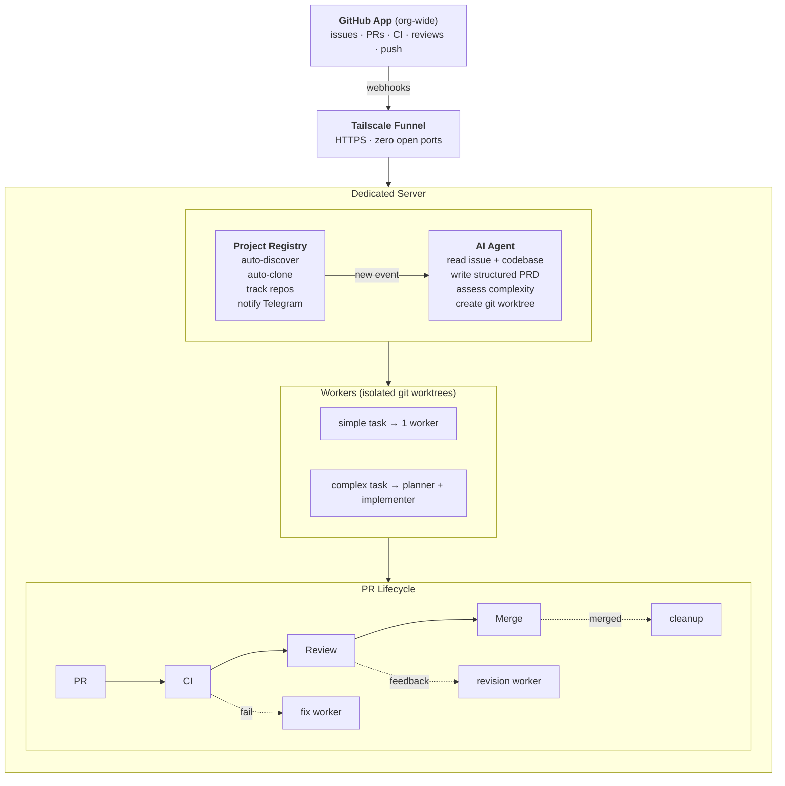
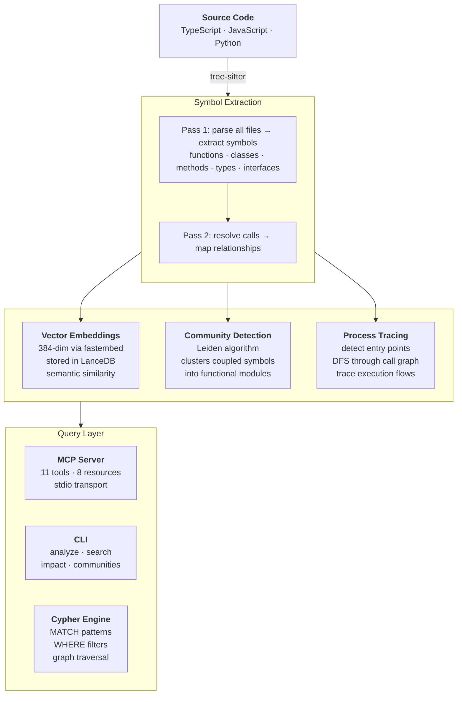

# Hey, I'm Marc

**Senior Software Developer**

I design and build the software infrastructure behind large-scale production: 
pipeline systems, workflow automation, and the developer tools that keep creative teams shipping.

10+ years across fullstack development, pipeline engineering, and ML/AI. 
Started as a Digital Artist, evolved through Pipeline TD into software architecture.

> Developed key production tools for [Eyeline Studios'](https://eyelinestudios.com/en/studios/stages) virtual production stages, 
> including LED volumes, volumetric capture, and the Light Dome.

---

### What I work with

---

### Let's connect

---

### GitHub Stats

  <picture>
    <source media="(prefers-color-scheme: dark)" srcset="https://streak-stats.demolab.com?user=marcmantei&theme=github-dark-blue&hide_border=true&v=2" />
    <source media="(prefers-color-scheme: light)" srcset="https://streak-stats.demolab.com?user=marcmantei&theme=default&hide_border=true&v=2" />
    
  </picture>

<picture>
  <source media="(prefers-color-scheme: dark)" srcset="https://github-readme-activity-graph.vercel.app/graph?username=marcmantei&theme=github-dark&hide_border=true&area=true&v=2" />
  <source media="(prefers-color-scheme: light)" srcset="https://github-readme-activity-graph.vercel.app/graph?username=marcmantei&theme=github-light&hide_border=true&area=true&v=2" />
  
</picture>

---

### Current focus

- **AI / ML:** LLM application patterns, RAG architectures, intelligent production automation
- **Developer Tooling:** self-healing systems, workflow orchestration, reducing friction at scale
- **AI Agent Infrastructure:** building autonomous dev agents that handle the full lifecycle from issue to PR

---

### AI Agent Infrastructure

I built and operate an autonomous agent network that functions as a one-person software team.

**The journey:** I first built a custom Agent Orchestrator that could react to GitHub events, manage Telegram communication, and coordinate coding tasks across multiple repositories. After proving the concept, I migrated to [Spacebot](https://github.com/AgenDev/spacebot), a Rust-based agentic system, and built a heavily customized layer on top — including a dynamic project registry, GitHub App integration, and Tailscale Funnel for secure webhook delivery.

**What it does today:**

**Key capabilities:**
- GitHub App with org-wide webhook delivery via Tailscale Funnel (zero open ports)
- Dynamic Project Registry: auto-discovers, auto-clones, and tracks all repos
- Enriches issues with auto-generated PRDs before implementation
- Isolated git worktrees enable parallel workers on the same project
- Complexity-based orchestration (sequential planning + implementation for complex tasks)
- Image generation via Gemini API with on-the-fly style extraction from project code
- Cross-channel coordination: GitHub webhooks, Telegram notifications, worker management
- Hot-reloadable config with daily automated backups

**Stack:** Spacebot (Rust) · Claude Opus/Haiku · Gemini Flash · Tailscale Funnel · GitHub App · SQLite · systemd

This setup lets me operate like a small software company: I create issues, and the agent network handles PRD writing, implementation, CI fixes, and review responses autonomously.

---

### Code Knowledge Graph

I built a code intelligence engine in Rust that parses source code into a queryable knowledge graph — giving AI agents deep architectural understanding of any codebase before they write a single line.

**The idea:** AI agents waste tokens and make poor decisions when they don't understand how a codebase fits together. Instead of letting them grep around blindly, I built a system that pre-analyzes code structure — extracting symbols, mapping call relationships, detecting functional modules, and tracing execution flows — then exposes it all through MCP, a CLI, and a custom Cypher query engine.

**How it works:**

**Key capabilities:**
- Parses TypeScript, JavaScript, and Python via tree-sitter with two-pass symbol resolution
- Hybrid search: BM25 keyword + vector semantic + Reciprocal Rank Fusion
- Community detection via Leiden algorithm — surfaces functional modules automatically
- Impact analysis: parses git diffs, then BFS through the call graph to find blast radius
- Symbol rename with full cross-reference resolution and preview before applying
- MCP server with 11 tools and 8 resources for direct AI agent integration
- Custom Cypher dialect for graph traversal queries (read-only, no write operations)

**Stack:** Rust · tree-sitter · LanceDB · fastembed · graphrs · rmcp · Cypher dialect

The engine is structured as a 6-crate Rust workspace — core analysis, storage, MCP server, Cypher engine, benchmarks, and a CLI — designed to be embedded into AI developer tools or run standalone.
